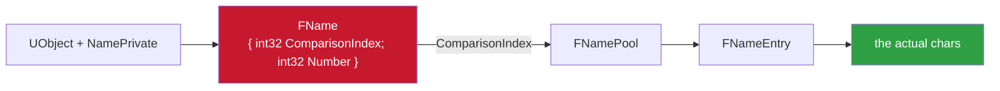
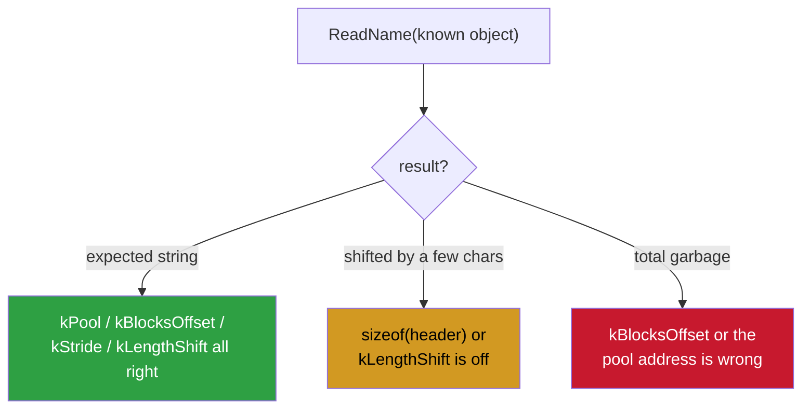

<h1 align="center">ue4-ios-fname-notes</h1>

<p align="center">turning an FName index into a string on iOS UE4 — walking FNamePool by hand, and the offsets that actually move between builds</p>

<p align="center">
  
  
  
</p>

---

Follow-up to my [ProcessEvent notes](https://github.com/shiedless/ue4-ios-processevent-notes).
Once you're inside a hook you have a `UFunction*` (or any `UObject*`) and you need its
name as a string. On iOS UE4 that means walking `FNamePool` by hand — because there's
no tidy `GetName()` you can just call from a hook without risking a call back into
engine code on an object that might be mid-teardown.

> Here's how I do it, and the offsets that actually move between builds.

---

## contents

- [what an FName even is](#what-an-fname-even-is)
- [the modern pool layout (UE 4.23+)](#the-modern-pool-layout-ue-423)
- [reading the entry](#reading-the-entry)
- [the old layout (UE 4.22 and earlier)](#the-old-layout-ue-422-and-earlier)
- [recovering the offsets per build](#recovering-the-offsets-per-build-dont-hardcode-blindly)
- [using it in a ProcessEvent hook](#using-it-in-a-processevent-hook)
- [gotchas that cost me time](#gotchas-that-cost-me-time)

---

## what an FName even is

An `FName` is two ints: a `ComparisonIndex` and a `Number`. The index points into a
global pool of interned strings (`FNamePool`; older builds call it
`FName::GetNames()` / `TNameEntryArray`). The `Number` is the `_N` suffix stuff — you
can ignore it for name matching most of the time.

A `UObject` carries its FName at `UObject::NamePrivate`. So the chain is:



Everything below is about turning that `ComparisonIndex` into a `char*`.

---

## the modern pool layout (UE 4.23+)

Newer engines use the block-allocated `FNamePool`. The lookup is:

```cpp
// entry = Pool.Blocks[ index >> BlockBits ] + Stride * (index & BlockMask)
FNameEntry* GetEntry(FNamePool* pool, uint32 index) {
    uintptr_t block = *(uintptr_t*)((uint8_t*)pool + BlocksOffset
                                    + (index >> BlockBits) * sizeof(void*));
    return (FNameEntry*)(block + Stride * (index & ((1 << BlockBits) - 1)));
}
```

Typical values I keep seeing on shipped arm64 builds:

| constant | typical | what it is |
|----------|---------|------------|
| `BlocksOffset` | ~`0xD8` | the array of block pointers inside the pool |
| `BlockBits` | `16` | so `BlockMask` = `0xFFFF` |
| `Stride` | `2` | entries aligned to 2 bytes; index low bits are a byte offset over 2 |

> [!WARNING]
> Don't take those as gospel — **they drift.** Recover them per build (see below).

---

## reading the entry

An `FNameEntry` starts with a small header that packs the wide-flag and the length:

```cpp
// header is a uint16 on most builds:
//   bit 0    -> bIsWide (UTF-16 vs ASCII)
//   bits >>6 -> length
uint16_t header = *(uint16_t*)entry;
bool     wide   = header & 1;
int      len    = header >> 6;
const char* str = (const char*)(entry + sizeof(uint16_t));  // chars follow the header
```

For ASCII names (which is what you want 99% of the time — function/class names are
ASCII) that's it, copy `len` bytes. If `wide` is set it's UTF-16; handle separately or
just skip, you rarely need those.

Full thing, the way it goes in a hook:

```cpp
bool ReadName(uintptr_t nameField, char* out, size_t cap) {
    if (!out || !cap) return false;
    out[0] = 0;

    int32_t index = *(int32_t*)nameField;          // ComparisonIndex
    if (index < 0) return false;

    uintptr_t block = *(uintptr_t*)(kPool + kBlocksOffset
                        + (uint32_t(index) >> kBlockBits) * sizeof(void*));
    if (!block) return false;

    uintptr_t entry = block + kStride * (uint32_t(index) & ((1u << kBlockBits) - 1));

    uint16_t header = *(uint16_t*)entry;
    size_t   len    = header >> kLengthShift;       // kLengthShift = 6 here
    if (!len || len >= cap) len = cap - 1;

    const char* src = (const char*)(entry + sizeof(uint16_t));
    for (size_t i = 0; i < len; i++) {
        char c = src[i];
        out[i] = (c >= 0x20 && c < 0x7F) ? c : '?'; // keep it printable
    }
    out[len] = 0;
    return true;
}

// an object's own name:
bool ObjectName(uintptr_t obj, char* out, size_t cap) {
    return ReadName(obj + kNamePrivate, out, cap);
}
```

> [!IMPORTANT]
> It **never calls into the engine.** Every access is a plain read, so a half-dead
> object at worst gives you garbage bytes, not a crash. That matters — your hook runs
> on the game thread while the game owns those objects.

---

## the old layout (UE 4.22 and earlier)

Older games use `TNameEntryArray`, a chunked array of `FNameEntry*`:

```cpp
// GNames is FNameEntry** split into chunks of 16384
FNameEntry* entry = GNames[index / 0x4000][index % 0x4000];
// name chars live at entry + AnsiNameOffset (often 0x10 or 0x18), length is
// derived from an Index field or a separate int, build-dependent
```

If you're on an old build, dump a couple of known entries and eyeball where the ASCII
starts. The header-packing trick above is a 4.23+ thing.

---

## recovering the offsets per build (don't hardcode blindly)

Two ways I actually use:

**1. The dump did it for you.** Whatever tool produced your SDK dump already resolved
`FNamePool`'s address and layout to print names, so lift the exact values from its
config/output. If your dump has correct class and function names, its FName constants
are correct by definition.

**2. Sanity-check at runtime.** Pick an object whose name you know (the local
`PlayerController`, `GEngine`) and print `ReadName` on it:



> [!NOTE]
> The **"wrong binary in IDA" trap** bites here too. If you rebased or opened the
> wrong slice, every derived address is silently off and the names look like noise.
> Confirm your image base before you blame the offsets.

---

## using it in a ProcessEvent hook

This is the whole point. In the hook you get `(UObject* obj, UFunction* fn, void* parms)`.
Read `fn`'s name and compare:

```cpp
void HookedProcessEvent(uintptr_t obj, uintptr_t fn, void* parms) {
    char name[128];
    if (ObjectName(fn, name, sizeof(name)) && !strcmp(name, "ServerSendFireInfos"))
        DoYourThing(parms);
    orig(obj, fn, parms);
}
```

> [!TIP]
> Matching by **name** is what makes the hook survive updates — function addresses
> move every patch, the name doesn't. Cache the resolved `fn` pointer after the first
> match if you want to drop the `strcmp` on the hot path; it's the same pointer for the
> life of the process.

---

## gotchas that cost me time

| gotcha | what to do |
|--------|------------|
| the length field position (`>> 6` here) is **not universal** | some builds pack it differently — always verify against a known name |
| `Number != 0` names exist (`Foo_2`) | for plain matching you read the entry text and ignore `Number`, but know it's there if a compare fails on a name you swear is right |
| reading the pool during a **level transition** can hand you an index into a block being rebuilt | wrap the read so a bad block pointer returns `false` instead of dereferencing zero |

---

<p align="center">
  <sub><b>part 5 of 7</b> in the <a href="https://github.com/shiedless/ios-ue4-re">ios-ue4-re</a> series</sub><br>
  <sub>← <a href="https://github.com/shiedless/ue4-ios-gworld-gnames-notes">ue4-ios-gworld-gnames-notes</a> · <a href="https://github.com/shiedless/ios-ue4-re">index</a> · <a href="https://github.com/shiedless/ue4-ios-processevent-notes">ue4-ios-processevent-notes</a> →</sub>
</p>

---

<p align="center">— shiedless</p>
